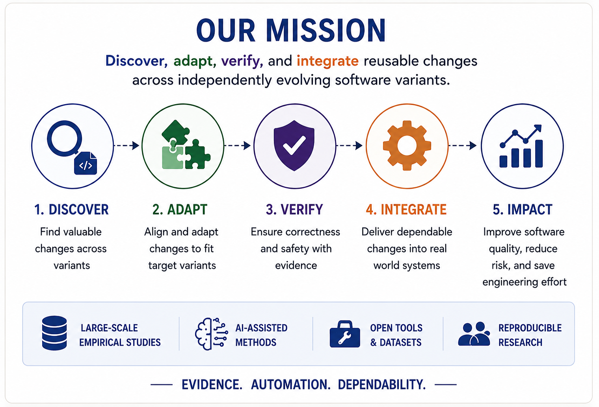

  

Building the Future of Dependable Software Evolution

The <strong>Software Evolution (EVOL) Lab</strong> develops intelligent methods
for software evolution, empirical software engineering, and AI-assisted software
engineering.

  <a href="https://unlv-evol.github.io/" style="display:inline-block;padding:12px 28px;background:#0b2e73;color:#fff;text-decoration:none;border-radius:6px;font-weight:600;">
    Enter the EVOL Lab Website →
  </a>

