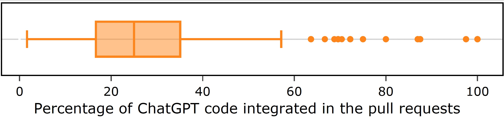

<div class="main-component">
<form action="/teaching/CS472/">
    <input type="submit" style="background-color:cornflowerblue;color:white;width:185px;
height:40px;" value="Course Overview" />
</form>

<form action="/teaching/CS472/Timetable/">
    <input type="submit" style="background-color:firebrick;color:white;width:185px;
height:40px;" value="Timetable" />
</form>
<form action="/teaching/CS472/Exam/">
    <input type="submit" style="background-color:cornflowerblue;color:white;width:185px;
height:40px;" value="Exam" />
</form>
<form action="/teaching/CS472/project/">
    <input type="submit" style="background-color:cornflowerblue;color:white;width:185px;
height:40px;" value="Project" />
</form>
</div>
<br/>

Labs
=======
<div class="main-component">
<form action="/teaching/CS472/Timetable/Git_and_GitHub/">
    <input type="submit" style="background-color:#008CBA;float:left; color:white;width:130px;
height:30px;" value="Git & GitHub" />
</form>
<form action="/teaching/CS472/Timetable/dynamic_analysis/">
    <input type="submit" style="background-color:#008CBA;float:left;color:white;width:130px;
height:30px;" value="Testing & CI" />
</form>
<form action="/teaching/CS472/Timetable/LLM/">
    <input type="submit" style="background-color:firebrick;float:left;color:white;width:130px;
height:30px;" value="Generative AI" />
</form>
</div>

<br/>
<br/>

# **This individual assignment is due March 3rd, 2026**

## **Objective**  

This assignment examines how Generative AI is used in real pull request workflows — including when suggestions are accepted, adapted, or rejected.

You are not required to use GenAI in your project. However, you are expected to understand how it is used and evaluated in professional software development.

### **Lab Structure & Grading**

This lab consists of a single graded component:

- **Quiz (30 points)** – A quiz designed to assess your understanding of how Generative AI is used in real pull request workflows, including when AI suggestions are adopted, adapted, rejected, or used for reasoning support.

The quiz questions are based on the lecture slides.  
The case studies below provide additional detail and context to support your understanding.
---

## **Introduction: Generative AI in Pull Request Workflows**

This lab examines how Generative AI (e.g., ChatGPT) participates in real-world software engineering workflows — particularly within **GitHub pull requests (PRs)**.

Rather than focusing on prompt techniques, this lab focuses on how AI suggestions are evaluated in practice:

- When they are **adopted**
- When they are **modified**
- When they are **rejected**
- When they influence reasoning without direct code integration

The material builds on empirical research analyzing AI-assisted pull requests in open-source repositories ([EMSE 2025; PatchTrack study](2025_EMSE_PatchTrack.pdf)).

Our findings show that AI participation is not binary. Instead, integration outcomes are shaped by engineering judgment, architectural alignment, maintainability constraints, and project scope.

---

## **GenAI Integration Outcomes**

We identify four primary outcomes when AI is used in pull requests:

- **PA (Patch Applied)** – AI-generated code is integrated (often partially).
- **PN (Patch Not Applied)** – AI suggestions are modified or rejected after review.
- **NE (No Existing Patch)** – AI provides conceptual or methodological guidance without direct code integration.
- **CL (Closed)** – The pull request is closed due to architectural, scope, or quality concerns, even if AI suggestions were technically valid.

---

## **Case Studies**

The following case studies illustrate how AI is used across these outcomes. 

As you read, consider:

- Who initiated AI use (author or reviewer)?
- Was the AI output integrated verbatim, adapted, rejected, or used only for reasoning?
- What engineering constraints influenced the final decision (architecture, maintainability, scope)?
- Did AI improve the quality of reasoning, even when its code was not merged?
---

## **Patch Applied (PA)**

In Patch Applied (PA) cases, AI-generated code is merged into the repository.  
However, structural preservation is often limited.

### **Empirical Observations (PA Cases)**

- The median structural integration of AI-generated patches is **25%**.
- AI-generated code is frequently **adapted rather than merged verbatim**.
- Even when merged, AI suggestions are typically refined to align with project standards and context.
- Integration reflects engineering judgment, not automatic acceptance.

The boxplot below shows the percentage of AI-generated lines preserved in merged pull requests.



**Integration Levels:**

1. **Low (0–25%)** – Minor structural preservation.
2. **Moderate (25–75%)** – Partial adaptation to project context.
3. **High (75–100%)** – Mostly integrated with minimal changes.

### **Example 1: Code Duplication and Refactoring**

- [PR link](https://github.com/nbd-wtf/nostr-tools/pull/241)
- [ChatGPT Link](https://chat.openai.com/share/f09f38e5-f541-4f98-9483-e183f5650398)

A developer used ChatGPT during the `Software maintenance` task of `code duplication and refactoring` in the `nostr-tools` project. The developer aimed to resolve code repetition and refactor the code.

The pull request shows code changes to address **duplication issues**, improving code quality. Code duplication often leads to maintenance challenges, bugs, and reduced readability. By using ChatGPT, the developer sought guidance to efficiently refactor the code.

**Developer Prompt:**
```text
I have some duplication in my TypeScript code. I want to resolve it by creating a discriminated union based on the keys and values of the interface. Is this possible?
```

<p align="center">
  
</p>

**GitHub file diff:** [View here](https://github.com/nbd-wtf/nostr-tools/pull/241/files#diff-98476df5961449c9b87e4a05e4cf190b90d14815cb1b23f1e2d5398467287b61)

<p align="center">
  
</p>


### **Example 2: Deployment Documentation**

Links to PR and ChatGPT conversation:
- [PR Link](https://github.com/swarmion/swarmion/pull/678)
- **Note:** The original ChatGPT conversation link has been deleted by the developer. However, all the necessary details and context from the conversation are provided here for your reference. You can still follow along with the example using the information already included.

Documentation plays a key role in ensuring effective communication and collaboration in software development. It can take various forms such as:
- **Requirements Documentation**: Specifications (functional & non-functional).
- **Design Documentation**: System architecture, data flow.
- **Technical Documentation**: Code, APIs, algorithms, and data.
- **Testing & QA Documentation**: Test plans and quality assurance.
- **Deployment Documentation**: Guidelines for software deployment.

In this case, the developer used ChatGPT to generate user-friendly, concise deployment documentation for the `release.sh` script. 

**Developer's prompt:**
```plaintext
Act as a developer advocate with 5 years of experience. Write quick documentation for this `release.sh` script. Use bullet points and short sentences. Add emojis where needed.
```

<p style="text-align:center">

</p>

<br />

As a result, the [`CONTRIBUTION.md`](https://github.com/swarmion/swarmion/pull/678/files#diff-eca12c0a30e25b4b46522ebf89465a03ba72a03f540796c979137931d8f92055) file was updated with documentation from ChatGPT to help new contributors get started.

<p style="text-align:center">

</p>


### **Example 3: Configuring GitHub Actions Workflow**

- [PR link](https://github.com/faker-js/faker/pull/2405) - [Git Diff File](https://github.com/faker-js/faker/pull/2405/files#diff-1918769d4ce5178c72d08b74f069e98856eeddcb0391e5c39636c8c33051f7f9)
- [ChatGPT Conversation](https://chat.openai.com/share/8cb16814-2855-4fbd-87e5-bde8ba349728)

In Examples 1 and 2 above, the developer used the code generated by ChatGPT "as-is." However, this example demonstrates another use case where the developer integrates only a *portion* of the code snippet suggested by ChatGPT. The prompt provided by the developer aligns with the `Configuring GitHub Actions Workflow` task, which falls under the `Software Configuration Management (SCM)` activity. SCM encompasses version control, configuration management, and process management. Configuring GitHub Actions workflow specifically relates to automating the building, testing, and deploying of code changes, which aligns with CI practices.

In this case, after reviewing the GitHub link and ChatGPT conversation, we can see that the developer is seeking guidance on setting up and configuring `GitHub Actions workflows` for the `Faker.js` library. The GitHub link shows changes made to the `GitHub Actions workflow` configuration file.

**Developer Prompt 1:** 
```plaintext
Write a GitHub Action yml file that blocks the PR from merging when there is a label named "do NOT merge yet" or "s: on hold"
```

**Developer Prompt 2:**
```plaintext
How can I check "s: on hold" with "contains" using "github.event.pull_request.labels.*.name"
```
Below is the final code snippet generated by ChatGPT and the portion integrated into the GitHub pull request.

<p style="text-align:center">

</p>

<p style="text-align:center">

</p>

----

## **Patch Not Applied (PN)**

### **Example 1: Adaptation and Tailored Solutions**
This example shows how ChatGPT's conceptual advice was adapted for customized solutions to fit unique project needs.
- [PR link](https://github.com/laravel-json-api/core/pull/12)
- [ChatGPT link](https://chatgpt.com/share/e9555822-4ffb-4845-8e40-0bc6cbbc658d)

#### **Conversation Summary**
* **Initial ChatGPT Suggestion:** ChatGPT provided a regex for ULID: `^[0-9A-HJKMNP-TV-Z]{26}$` to match a 26-character string using base32 encoding.
* **Reviewer's Suggestion:** The reviewer (`@lindyhopchris`) recommended using Laravel's `whereUlid()` regex for consistency, aligning with how ULIDs are handled in the Laravel framework. 
The Laravel [regex](https://github.com/laravel/framework/blob/53b02b3c1d926c095cccca06883a35a5c6729773/src/Illuminate/Routing/CreatesRegularExpressionRouteConstraints.php#L48) provided by the reviewer is

    ```regex
    [0-7][0-9a-hjkmnp-tv-zA-HJKMNP-TV-Z]{25}
    ```

    This regex specifies that the first character is a digit between 0-7, followed by 25 base32 characters.

* **PR Author's Acceptance:** The author (@Ashk2a) acknowledged the feedback and updated the code (File [MatchedIDs.php](https://github.com/laravel-json-api/core/pull/12/files)) to reflect the Laravel-style regex:

    ```php
    public function ulid(): self
    {
        return $this->matchAs('[0-7][0-9a-hjkmnp-tv-zA-HJKMNP-TV-Z]{25}');
    }
    ```

#### **Conclusion**
This pull request demonstrates how the developer adapted ChatGPT’s suggested regex to meet the specific requirements of the project. The task falls under the Software Engineering activity of **code customization**, as the developer further modified the generated code to align with project standards and feedback. This aligns with the theme of **adaptation to project needs**, where conceptual advice from ChatGPT was tailored to ensure consistency with Laravel’s framework.


### **Example 2: Methodological Guidance**
This theme focuses on how **ChatGPT's advice informs approaches or refined solutions**, rather than being directly applied as patches. The emphasis is on broader strategies influenced by ChatGPT.

* [PR link](https://github.com/darklang/dark/pull/5063)
* [ChatGPT Link](https://chat.openai.com/share/2a6f10f0-d45d-4e71-ac57-584570baeda8)

The developer's interaction with ChatGPT in this pull request demonstrates a progression from a complex to a simpler, more efficient solution. Here's a breakdown:

#### **Initial Code (Before ChatGPT's Suggestion)**

<p style="text-align:center"></p>

In the initial code, the developer uses `System.Char.ConvertToUtf32` to convert a `char` to its Unicode (UTF-32) code point. While effective, this method is mainly suited for handling UTF-16 surrogate pairs and is unnecessary for basic `char` values. It's an overly complex solution for ASCII or basic Unicode characters.

The reviewer (@pbiggar), after consulting ChatGPT, noted that casting the `char` to an `int` would achieve the same result in a simpler and more efficient way. **ChatGPT suggested casting `char` to `int`**, which directly returns the Unicode (or ASCII) code point for the character—perfect for most simple characters.

#### **Refined Code (After ChatGPT’s Suggestion)**
The refined code can be found in the file [backend/src/BuiltinExecution/Libs/Char.fs](https://github.com/darklang/dark/pull/5063/files#diff-2949d723a79b066aa811f68b3bc6f1aa712cf44b63c8210febd62378a408c536).

<p style="text-align:center"></p>

In the updated version:
* **Simplified Conversion**: The developer replaced `System.Char.ConvertToUtf32` with `int c.[0]`, which is a simpler and direct way to get the integer (ASCII/Unicode) value of a character.
* **Added Validation**: Additional logic was included to handle edge cases:
  * **Digit Check**: The code checks if the character is a digit using `System.Char.IsDigit(c[0])`.
  * **Range Validation**: It verifies that `charValue` is within the `[0, 256)` range, ensuring the value is within the ASCII range.
  * **Conditional Handling**: If `charValue` is valid, it returns `Dval.optionSome (DInt charValue)`, otherwise it returns `Dval.optionNone`.

#### **Conclusion**
The interaction in this pull request is a clear example of **methodological guidance**, where ChatGPT’s advice helps refine the developer's approach instead of being directly applied as a patch. This refinement aligns with the Software Engineering task of **program repair**, as it involved simplifying and improving the initial code to address inefficiencies.

By following ChatGPT's advice, the developer made the code more efficient and easier to maintain, demonstrating how **methodological guidance** can lead to better solutions in software engineering.

----

## None Existing Patch (NE)
### **Example 1: Conceptual Guidance & Theoretical Advice**
This theme emphasizes programming concepts, design principles, and optimization strategies, focusing on best practices for readability and maintainability without specific code implementations.

- [PR link](https://github.com/codecrafters-io/frontend/pull/1061)
- [ChatGPT Link](https://chat.openai.com/share/d668d64c-182e-4e9d-8e17-6517d91fc65e)

Let's break down the situation to understand how the developer changed their code based on the ChatGPT conversation:

#### **Original Problem**
<p style="text-align:center"></p>

The developer was using the variable name `pricingFrequencyClicked`, which was problematic because the name implied an action (a click) rather than a state (the selected frequency). This didn't accurately reflect what the variable was being used for: to store the **selected pricing frequency** (e.g., 'monthly' or 'yearly').

#### **Developer's Implementation**
The final updates in the PR can be viewed in the file: [app/controllers/pay.js](https://github.com/codecrafters-io/frontend/pull/1061/files#diff-430dcbc461b77b60fd320d970946d870ed279a2952a06350872de59304e427e8).

<p style="text-align:center"></p>

After the ChatGPT conversation, the developer renamed `pricingFrequencyClicked` to `selectedPricingFrequency`. This new name more accurately reflects that the variable holds the user's selection for pricing frequency, improving both readability and maintainability of the code.

#### **ChatGPT's Advice**
ChatGPT highlighted the issue with the variable name, explaining that `pricingFrequencyClicked` was not appropriate because it didn't align with the variable's purpose. It suggested using a name like `selectedPricingFrequency` to more accurately reflect that the variable holds a selection, not an action.

#### **Conclusion**
This interaction falls under the **"Conceptual Guidance & Theoretical Advice"** theme, where ChatGPT's recommendations helped improve the clarity and maintainability of the code by suggesting better naming conventions. This aligns with the software engineering tasks of **code review** and **code quality enhancement**, as it involved refining naming practices to enhance readability and maintainability.

In this case, ChatGPT played a key role in informing the process of improving code structure and long-term maintainability, aligning with these software engineering tasks.


### **Example 2: Debugging and Optimization Strategies**
This theme focuses on debugging methods, performance optimization, and refining algorithms, offering strategic insights into problem-solving approaches without providing specific code snippets.

- [PR link](https://github.com/darklang/dark/pull/5068)
- [ChatGPT Link](https://chat.openai.com/share/7fe27ca4-5c0e-431b-953b-7f6e23710b5c)

Let's break down how the developer improved their code based on a conversation with ChatGPT:

#### **Original Code**
<p style="text-align:center"></p>

Initially, the developer was using `pushBack`, which appends an element to the end of a list. However, repeatedly using this operation can be inefficient, as it may require traversing the entire list, especially in larger datasets.

#### **ChatGPT's Advice**
After consulting ChatGPT, the developer received a suggestion to optimize the list operation by switching to `push` (which likely adds elements to the front of the list) and then reversing the list at the end. This approach is generally more efficient because adding to the front of the list is an O(1) operation in many functional languages, whereas `pushBack` can be an O(n) operation, where n is the length of the list.

#### **Updated Code**
The optimized code can be found in this PR file: [backend/testfiles/execution/stdlib/result.dark](https://github.com/darklang/dark/pull/5068/files#diff-ad820db3a141ba69514679a4698e3acb98c351faa8e2aaca9c3511c2740b8c19).

<p style="text-align:center"></p>

In this updated code:
- The developer switched to using `push` (adding to the front) and planned to reverse the list at the end.
- This new approach enhances performance, as adding to the front of the list is typically O(1), whereas using `pushBack` could result in O(n) complexity.

#### **Conclusion**
This interaction falls under the **Debugging & Optimization Strategies** theme, where ChatGPT provided advice to improve performance. Rather than directly offering a code solution, ChatGPT suggested a strategy—appending elements to the front of the list and reversing it later—to optimize performance. This aligns with the Software Engineering task of **performance optimization**, where the developer refined the algorithm based on ChatGPT's advice, ultimately enhancing the efficiency of the code.

ChatGPT played a key role in guiding the developer toward a more efficient solution for handling list operations, demonstrating how strategic advice can lead to performance improvements in software engineering.


## **Closed (CL): Architectural Misalignment and Scope Constraints**

This example shows how AI-assisted reasoning surfaced a deeper architectural issue, but the pull request was closed without merging.

- **Repository/PR**: `gemini-hlsw/scheduler` — **PR #428**
  - PR (conversation): https://github.com/gemini-hlsw/scheduler/pull/428
  - PR (files changed): https://github.com/gemini-hlsw/scheduler/pull/428/files
  - PR (changes view): https://github.com/gemini-hlsw/scheduler/pull/428/changes
- **Reviewer who initiated AI use**: `@sraaphorst`
- **PR author**: `@stroncod`

---

### **What the PR changed (local fix)**

One of the core changes replaced object-based membership checks with ID-based checks:

```python
has_resources = all([resource in nc[night_idx].resources for resource in obs.required_resources()])
has_resources = all([resource.id in [r.id for r in nc[night_idx].resources] for resource in obs.required_resources()])
```

**Motivation**: membership checks were failing after pickling/unpickling `Resource` objects, so the PR worked around the issue by comparing IDs instead of objects.

### **How ChatGPT Was Used (Reviewer-Driven)**

The reviewer linked two ChatGPT conversations directly inside the PR discussion:

---

**Link 1 — Performance / Correctness Check**  
https://chatgpt.com/share/1820dca2-0ac8-45da-82f7-dc81ae12325f  

**Goal:**  
- Confirm that `[r.id for r in ...]` is rebuilt repeatedly inside `all(...)`.  
- Suggest a more efficient approach (e.g., precomputing a `set` or `frozenset` of IDs).  

---

**Link 2 — Architectural Root Cause**  
https://chatgpt.com/share/06cc669e-9b94-46b7-bb66-e5de348251da  

**Goal:**  
- Explain why pickling/unpickling breaks flyweight identity.  
- Propose preserving canonical `Resource` instances by routing unpickling through `ResourceManager.get_resource(...)` (e.g., via `__reduce__` or `__setstate__`).  

### **Why the PR Was Closed (Key CL Insight)**

Even though the local change “worked,” the reviewer argued that the real issue was **architectural consistency**, not just correctness.

- The system intends `Resource` to behave as a **flyweight** (canonical instances managed by `ResourceManager`).
- After unpickling, new `Resource` instances are created, breaking identity consistency across the codebase.
- Properly fixing this requires a broader refactor (custom unpickling + possible relocation or reuse of `ResourceManager`), which exceeded the scope of the submitted PR.

**Outcome:**  
The PR was closed without merge because it addressed the symptom locally, but did not implement the deeper architectural solution.

# **Getting Started With ChatGPT**

To start using ChatGPT, go to [https://chat.openai.com/](https://chat.openai.com/) and create a free account. For this class, the free version of ChatGPT 3.5 is sufficient.

To make the most of ChatGPT, it’s important to provide well-structured prompts. The concept of **Prompt Engineering** is explored in this research paper: [A Prompt Pattern Catalog to Enhance Prompt Engineering with ChatGPT](https://arxiv.org/abs/2302.11382).

## Sharing Your ChatGPT Conversations on GitHub

Sharing your ChatGPT conversations with other developers can be highly beneficial for several reasons, such as:
- Collaborative problem-solving
- Learning and knowledge sharing
- Code review and improvement
- Gaining diverse perspectives
- Sharing best practices and tips
- Avoiding common pitfalls
- Building a supportive community
- Ethical considerations
- Innovation and exploration

### How to Share Your ChatGPT Conversations

1. **Generating a Shareable Link**:
   Once you're ready to share your ChatGPT conversation, follow the steps below to generate a shareable link. 
   **Note:** Your personal profile will be anonymized when the conversation link is generated.

   <p style="text-align:center"></p>

   <p style="text-align:center"></p>

2. **Sharing on GitHub**:
   After copying the link, you can include it in various places on GitHub, such as a pull request (PR), issue, or commit message. For instance, if ChatGPT helped you solve a bug, you could include the link in the PR description or during a PR review. See examples below:

   - **Adding the conversation link in a PR description**:

     <p style="text-align:center"></p>

   - **Adding the conversation link during PR review**:

     <p style="text-align:center"></p>

    

