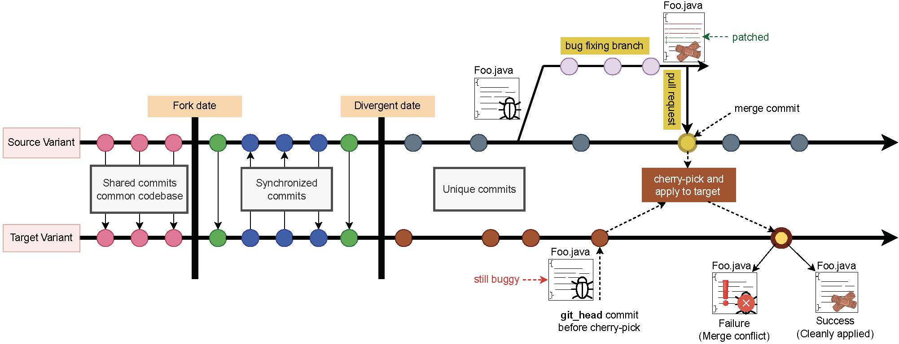

<form action="/teaching/Software-Reengineering/">
    <input type="submit" style="background-color:cornflowerblue;color:white;width:185px;
height:40px;" value="Course Overview" />
</form>
<form action="/teaching/Software-Reengineering/metrics/">
    <input type="submit" style="background-color:cornflowerblue;color:white;width:185px;
height:40px;" value="Metrics and Visualization" />
</form>
<form action="/teaching/Software-Reengineering/refactoring/">
    <input type="submit" style="background-color:cornflowerblue;color:white;width:185px;
height:40px;" value="Refactoring Assistants" />
</form>
<form action="/teaching/Software-Reengineering/dynamic/">
    <input type="submit" style="background-color:cornflowerblue;color:white;width:185px;
height:40px;" value="Dynamic Analysis: Testing" />
</form>
<form action="/teaching/Software-Reengineering/integration/">
    <input type="submit" style="background-color:cornflowerblue;color:white;width:185px;
height:40px;" value="Software Integration" />
</form>
<form action="/teaching/Software-Reengineering/msr/">
    <input type="submit" style="background-color:cornflowerblue;color:white;width:185px;
height:40px;" value="Mining Software Repositories" />
</form>
<form action="/teaching/Software-Reengineering/project/">
    <input type="submit" style="background-color:firebrick;color:white;width:185px;
height:40px;" value="Reengineering Project" />
</form>

<br/>
<br/>

Target Application
==============
[LinkedIn](https://github.com/linkedin/kafka) project is a variant fork of [Apache Kafka](https://github.com/apache/kafka) running at LinkedIn. 

Kafka was born at LinkedIn. The run thousands of brokers to deliver trillions of messages per day. They run a slightly modified version of Apache Kafka trunk. The [LinkedIn](https://github.com/linkedin/kafka) variant contains the LinkedIn Kafka release.

Assignment
==========

### 1. Contextualization of the Project

[LinkedIn](https://github.com/linkedin/kafka) is a clone-and-own variant of 
[Apache Kafka]((https://github.com/apache/kafka)) that was created by copying and adapting the existing 
code of Apache Kafka that was forked on 2011-08-15T18:06:16Z. The two software systems kept on synchronizing 
their new updates until ```2022-06-02T17:08:43Z```. Since ```2022-06-02T17:08:43Z``` (divergence date), the two 
projects do not share common commits yet actively evolve in parallel. Currently, ( as of ```2025-10-01T15:01:39Z```), 
LinkedIn has 471 individual commits, and Apache Kafka has 7,199 individual commits. Development becomes 
redundant with the continued divergence, and maintenance efforts rapidly grow. For example, if a bug is 
discovered in a shared file and fixed in one variant, it is not easy to tell if it has been fixed in the 
other variant.

**General problem illustration**

The figure below illustrates clone-and-own, where variant2 (forked repository) was 
cloned-and-owned from ```Source Variant``` (original repository). When ```Target Variant``` forked by the 
developer  (```fork_date```), it inherited all commits from variant1. Then, between the 
```fork_date``` and ```divergence_date```, both variants synchronized commits, keeping both 
variants even. After the ```divergence_date```, the variants stopped synchronizing commits.



Let us assume that the developer of ```variant1``` identified a bug after the 
```divergence_date``` in file `Foo.java`. The developer 
then decided to create a ```bufixing branch``` on the source 
repository, ```patched``` the ```buggy``` file, and finally integrated the ```patch```
back into the ```main branch``` of the ```Source Variant``` using a ```pull request```. 
When the maintainer of ```Target Variant``` wants to integrate the `bug fix` from the ```Source Variant``` into the ```git_head```,
there are two possible scenarios:

1. The commit will successfully integrate into the ```Target Variant```.
2. The commit will fail to integrate as a result of merge conflicts in the file `Foo.java`.

Since the fork has diverged, shared file(s) in a patch (pull request) may have changed between the 
source and target variants. As a result, direct `git cherry-pick` integration often produces **merge conflicts**. 
Some of these conflicts are purely textual, while others arise because of **refactoring operations** that 
were applied independently in the two variants (e.g., Apache Kafka vs. LinkedIn Kafka).  

In this course we use **[RePatch](https://github.com/Software-Reengineering/RePatch)**, 
which performs **refactoring-aware patch integration** by aligning source and target code 
around detected refactorings and replaying those changes.  

You have already seen how to run RePatch in the **Software Integration Lab** (Task 2 with PR #13386).  
For the project, you are expected to:  
- Reuse the same integration workflow shown in the lab, or follow the [RePatch README](https://github.com/Software-Reengineering/RePatch) for full instructions.  
- Inspect the results in the RePatch database (`merge_result`, `conflicting_files`, etc.) and document how conflicts were resolved, or why they could not be resolved.  
- Connect your observations back to reengineering patterns from the OORP book.  

### 2. Pull Request Categories  

You will work on pull requests from the following four categories.  
[PR Categories Spreadsheet](https://docs.google.com/spreadsheets/d/1c2Y9p3mnBy5i_TP-7TNk2LkesAIsvoPma1MzAkU6WkA/edit?usp=sharing)  

Each student will analyze:  
- **Category 1:** 1 PR  
- **Category 2:** 2 PRs  
- **Category 3:** 1 PR  
- **Category 4:** 3 PR  

Although each student is responsible for selecting and working on their PRs, you are expected to **collaborate as a team**.  
- Discuss your findings, challenges, and approaches together.  
- Share insights on conflicts, testing, and coverage.  
- Submit one **joint team report** that consolidates everyone’s contributions.  
- Inside the report, clearly **label which PRs were handled by each student** to ensure individual work is identifiable.   

#### Category 1: Cherry-pick succeeds and includes tests  

- Git cherry-pick succeeds without conflicts.  
- The integrated code is already covered by tests in the target repository.  

**Task:**
* Identify the **merge commit** of the patch pull request using techniques from the [Mining Software Respositories](/teaching/Software-Reengineering/msr/) class.
* Run `git cherry-pick` on the identified merge commit.
* Validate the integration by running the existing test suite.


#### Category 2: Cherry-pick succeeds but missing tests
- Git cherry-pick succeeds without conflicts.  
- Some of the changed files lack test coverage in the target repository.

**Task:**
* Identify the **merge commit** of the patch pull request using techniques from the [Mining Software Respositories](/teaching/Software-Reengineering/msr/) class.
* Run `git cherry-pick` on the identified merge commit.
* Write the missing unit/integration tests for the uncovered changes.
* Measure coverage before and after adding the tests to ensure improvement.
 
#### Category 3: Cherry-pick fails, RePatch succeeds

* Git `cherry-pick` fails due to structural divergence.
* RePatch successfully resolves conflicts and integrates the PR.
* Some files may or may not have test coverage.

**Task:**
* Run RePatch and inspect the generated integration results to ensure correctness.
* Validate the integration by running the existing test suite.
* If tests are missing, write unit/integration tests for the uncovered changes.
* Measure coverage before and after adding tests to confirm improvement.


#### Category 4: Cherry-pick fails, RePatch cannot resolve conflicts

* Both Git `cherry-pick` and `RePatch` fail due to **unsupported refactorings** or **complex semantic/textual conflicts**.

**Task:**
* Identify and document the specific reason for failure (e.g., unsupported refactoring, semantic conflict, or other complex change).
* Attempt small,  e (e.g., updating a method signature, adding a missing parameter).
* If integration remains infeasible, clearly explain why developer intervention and domain knowledge are required.
* Reflect on the nature of these conflicts and discuss potential directions for extending or improving **RePatch** to handle them.

### 3. Getting Started Instructions
Please pay attention to the following instructions:  

- Each group must prepare a **Pre-conditions Report** (PDF format).  
- Only **one member per group** should submit the report on Canvas on behalf of the group.  
- The report must include:  
  - The full names of all group members (maximum of 3 people per group; groups of 1–2 are also allowed).

* Your Pre-conditions Report should contain the following:
  * Project Name
  * Full names of all the members in your group
  * A link to your GitHub repositories (which shows you already forked [LinkedIn](https://github.com/linkedin/kafka)
  * The members are set as collaborators to the GitHub project.
  * Invite me as collaborator on your forked repositories. (my [GitHub ID - ```johnxu21```](https://github.com/johnxu21)).
* Demonstrate the ability to build the projects. For this, we want a statement from the group 
attesting they managed to successfully build the projects. You can also attach a screenshot of 
your IDE with the project source and a message like "build successful".
* Simple Class Diagram of one of the pull requests being patched (or buggy target). A simple class diagram has 
only the name of the class and its interactions with the other classes (there are two examples in 
[JPacman repository in the "docs" folder](https://github.com/johnxu21/jpacman/blob/master/doc/uml/FactoryWiring.png)). This is to reinforce your initial understanding of the 
system. You only need to focus on the classes associated with the patch and the classes that are 
called in those classes. There is no need to go deeper into the class structure (i.e., if buggy 
class calls Class X, and Class X calls Class Y, then you do not need to show Class Y since it is 
not being called directly by the buggy class). We are not going to evaluate your strictness to the 
proper UML notations, therefore focus on modeling and understanding classes interactions. 

### Pre-conditions Report  

Each group must submit a **Pre-conditions Report (PDF)**. Only one member should upload it on Canvas on behalf of the team.  

The report should include:  

#### 1. Group & Repository Setup  
- Project name  
- Full names of all group members  
- Link to your **forked LinkedIn Kafka repository**  
- Confirmation that all group members are added as collaborators  
- Add me as a collaborator on your fork (`GitHub ID: [johnxu21](https://github.com/johnxu21)`)  

#### 2. Build Confirmation  
- A short statement confirming that your group was able to **successfully build the project**  
- Each group member must include a **screenshot from their own IDE** showing the project source and a *“Build Successful”* (or equivalent) message  
- All screenshots should be compiled into the same PDF report  

#### 3. Initial System Understanding  
- Provide a **simple class diagram** for one of the pull requests you will work on (or the buggy target)  
- Focus only on:  
  - The class(es) affected by the patch  
  - The classes directly called by those classes  
- Do **not** include transitive dependencies (e.g., if Class A calls Class B, but Class B calls Class C, you don’t need to include Class C)  
- Strict UML notation is **not required** — clarity of interactions is the priority  
- See examples in the [JPacman repository (“docs” folder)](https://github.com/johnxu21/jpacman/blob/master/doc/uml/FactoryWiring.png)  

#### 4. Team Coordination (Optional)  
You may include a short plan for how your team will coordinate during the project.  
This is not graded, but it will help your group stay organized.  

Consider including:  
- **Meeting Schedule**: How often will you meet (weekly, bi-weekly)? Online or in person?  
- **Communication Tools**: Which tools will you use (Discord, Slack, email, GitHub issues)?  
- **Collaboration Practices**: How will you share progress on your assigned PRs (e.g., regular updates, peer reviews, or joint testing sessions)?  
- **Contingency Plan**: How will you handle missed deadlines, unresolved conflicts, or a teammate being unavailable?  


### **4. General Coding Instructions**

When working on this assignment, follow these repository and coding practices:  

* **Fork and Clone**  
  - Fork [LinkedIn Kafka](https://github.com/linkedin/kafka) and clone the source code for your team to work on.  
  - Refer to the project’s documentation for build instructions, but adapt as needed since open-source projects may have outdated documentation.  

* **Collaboration**  
  - Add all members as collaborators on the fork.  
  - Ensure that everyone has access to build, test, and push changes.  

* **Commit and Push Practices**  
  - Commit and push **regularly** with clear, descriptive messages.  
  - Each commit should represent a **single coherent activity** (e.g., resolving a conflict, adding tests, applying a patch).  
  - Avoid large commits that combine unrelated changes.  

* **Commit Message Guidelines**  
  - Write concise messages that explain the purpose of the change.  
  - Examples:  
    - `fixing merge conflicts on patch X, class Y`  
    - `adding unit tests for class Y`  
    - `refactoring class Y to apply patch + added new test`  
  - If possible, separate code changes and tests into different commits (this improves traceability).  

* **Commit History and Evaluation**  
  - Your GitHub commit history will be reviewed as part of the evaluation.  
  - A consistent, clear, and incremental history is expected.  
  - Make sure to commit and push the **final version** of your reengineering project before the deadline. 

### **5. Development Activities** 
For each assigned pull request (according to the four categories), perform the following activities and document them in your project report.  

----------
#### I. Design Recovery 


<center>

</center>


- Describe the current design of the classes and methods affected by the pull request in the **target variant**.  
- Show how these classes fit into the broader architecture (e.g., their direct dependencies and interactions).  
- A simple class diagram is sufficient; focus on clarity, not UML formality.  

----------
#### II. Design Adaptation / Redesign 

<div style="text-align: center;">

</div>

- Analyze how the integrated change (patch) modifies or extends the existing design.  
- Compose a **revised design view** that shows how the functionality now fits into the system and interacts with related components.  
- If you wrote new tests, explain how the design of the test suite evolved to handle the change.  
- Confirm that the redesign supports the new feature/bug fix without degrading code quality.  

----------
#### III. Integration and Testing  
- Attempt to integrate the PR using `git cherry-pick`.  
- If cherry-pick fails, run **RePatch** and document the results.  
- Validate the integration by running the test suite of the target variant.  
- If tests are missing, write appropriate unit/integration tests.  
- Report **coverage before and after** integration and reflect on the adequacy of the test suite.  

----------
#### IV. Effort Estimation and Risk Assessment  

<div style="text-align: center;">

</div>

- Estimate the effort required for:  
  - (i) integrating the patch, and  
  - (ii) creating/adapting tests.  
- Identify PRs that were **exceptional entities** (e.g., large number of files changed, complex conflicts).  
- Comment on risks to maintainability and potential long-term design debt introduced by the integration.  

--------
#### V. Refactoring and Manual Resolution 

<div style="text-align: center;">

</div>

- If RePatch cannot resolve conflicts, attempt **manual resolution** (e.g., adjusting parameters, handling renamed methods).  
- Document any **refactorings** you performed to make the integration feasible.  
- If manual resolution is not possible without developer intent, explain why.  
- Ensure tests remain effective and coverage is preserved after changes.  

----------

#### VI. Reflection on Patterns, Techniques, and Teamwork  

- Identify the **reengineering patterns** from the OORP book that informed your design, integration, testing, and refactoring decisions.  
- Reflect on how your team coordinated across categories (meetings, reviews, shared testing).  
- Summarize lessons learned about **design, variant-aware integration, and testing**.  

In addition, your report should demonstrate the use of techniques introduced in the lab sessions:  
- **Analyzing:** Metrics & Visualization; Mining Software Repositories.  
- **Restructuring:** Testing, Refactoring, and Integration.  

You are not required to use every technique, but you must **justify your choices**:  
- Explain why you applied certain techniques and why others were not relevant to your case.  
- Discuss the **benefits and drawbacks** of the chosen approaches.  
- You may also use alternative techniques or tools if they are better suited, but explain why.  

**Testing requirements:**  
- Determine how well the existing tests provide feedback for your refactoring and integration steps.  
- **Quantify adequacy** (e.g., show coverage before and after).  
- Argue whether the tests are sufficient for your chosen scenario.  
- If they are inadequate, adjust or extend them efficiently—balance thoroughness with time investment.  

--------

### 5. General Evaluation
To show that you have passed the assignment, you will have to demonstrate the following:

* You possess the knowledge to plan and selected the appropriate reengineering patterns for your project activities.
* You have made a selection of analysis techniques (e.g., code integration, mining software 
repositories, metrics and visualization as seen in the lab sessions, but others are allowed 
as well), and have applied these techniques in a sound, systematic manner. You have indicated 
clearly (using screenshots, results of the interpretation of the output of the techniques) 
how you have used the results of these analysis techniques.
* You have performed the above activities (decomposed into (i) Design Recovery; (ii) Redesign; 
(iii) Management; and (iv) Refactoring) and discussed them in your project report.
* The restructurings you have applied are behavior preserving:
  * You can demonstrate the mapping between each of the classes from the original structure 
  with the new structure.
  * The compilation process succeeds flawlessly.
  * The tests run without flaws and show increased testing coverage making it more reliable.
* The introduction of the new design clearly indicates the project is ready to be released in a 
language of choice. You are not supposed to carry out the refactoring process completely. 
Select and execute a set of refactorings that sufficiently illustrate your proposed solution.
* The report is written in a clear manner detailing all the steps and reasoning for the project. 
Remember that the report is the document that registers all your work. Thus, it is the most 
important artifact for the evaluation process.

For a more precise on-point view of the evaluation criteria, please look over the check-list 
(for each report) on the course's main page.

### 6. Report 
Aspects that we typically like to see addressed in the final report are:
* **Context**: Briefly discuss the context in which you are running your project (do not just 
copy verbatim the text on 1. Contextualization).
* **The Problem at Hand**: Clarify the problem at the base of the project, and indicate its 
intrinsic difficulties (again, do not just copy the assignment problem description, elaborate 
based on your chosen interpretation, goals, and scope).
* **Reengineering Patterns**: You explicitly state the patterns (from the OORP book) that you 
selected and used throughout the project.
* **Project management**: Demonstrate how you have organized the work, and how you are controlling 
it (instead of the work controlling you!)
  * **Scope**: What are the boundaries of your project? What is not included in the project?
  * **Risks**: Which risks were envisioned, and which have been mitigated? What is the priority 
  of the risks that still need to be mitigated? E.g., which external dependencies might have an 
  effect on your outcome? Which alternatives have you prepared in case this risk instantiates?
* **Software reengineering**:
  * **Tests**: How can you verify that you satisfy the requirements? Which testing strategy have 
  you selected, and what are the arguments for this selection? How confident are you that your 
  solution satisfies the requirements?
  * **Quality assurance**: What are the non-functional requirements? E.g., how do you differentiate 
  between a good and a bad solution?
  * **Refactoring**: Which refactorings did you perform on the project? Why is it better now? 
  How does your refactoring help to support the new intended features?

Those are aspects we like to see addressed/tackled/discussed/explained/presented in the Final 
Report. In the Intermediate Report, we expect less detail. However, groups that try to start 
addressing some of the above concerns most often have a better Intermediate Report. In the 
Pre-conditions Report, although not necessary, it might be better if your group starts to plan 
the scope and goals for the project.

Please also keep in mind and check the Report Guidelines and the Evaluation Checklist on the main page.

### 7. Final Remarks
If you have any questions about the project or the report, please contact me.


 


 


